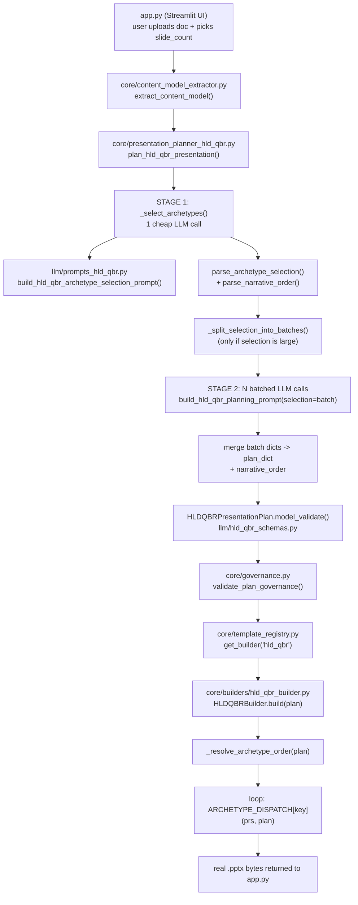
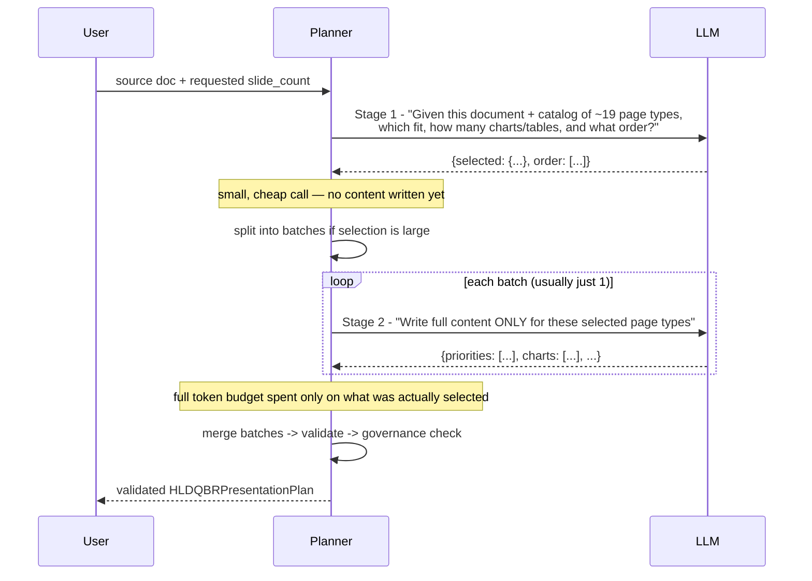
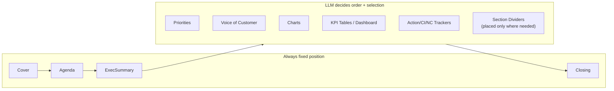

# HLD QBR Generation — Flow Diagram

Plain-language explanation + Mermaid diagrams of how a source document becomes a
finished, brand-templated HLD QBR `.pptx`. Companion reference to
[HLD_QBR_TEMPLATE_PLAN.md](HLD_QBR_TEMPLATE_PLAN.md).

---

## 1. Layman explanation

Think of it like ordering a custom slide deck from an assistant who only has one
fixed set of branded page designs to work with (a "sticker book" — cover,
org-chart page, quote page, chart page, table page, etc.) but total freedom
about **which** stickers to use, **what order**, and **what to write** on each.

1. You hand over a document and say "I want about N slides."
2. The assistant **skims the document first, before writing anything** — it
   decides which page-types actually fit what's really in your document, and
   what order tells the best story. It does not default to the same handful
   of pages every time.
3. **Only then does it write** the real title/content for each chosen page —
   grounded in your document's actual numbers, names, and quotes. No evidence,
   no slide — it leaves things out rather than inventing them.
4. **Large slide counts are written in batches** (like chapters instead of one
   breathless paragraph) so quality doesn't drop under a big request.
5. A **safety-checker** reviews everything before anything is built.
6. A **builder** assembles the real PowerPoint — copying the right branded
   page for each chosen topic, filling in the assistant's content, and
   stapling them together in the decided order. Cover → Agenda → Executive
   Summary always open the deck; Closing always ends it — everything else is
   flexible.
7. Out comes a finished `.pptx`.

---

## 2. Technical flow (end-to-end)

---

## 3. Stage 1 vs Stage 2 (why two LLM calls, not one)

---

## 4. Builder: order-driven assembly (no more fixed sequence)

Each box in "Flexible" is one function in `ARCHETYPE_DISPATCH` — the builder
calls them in whatever order `plan.narrative_order` specifies (falling back to
a default fixed order only if the LLM's order is missing/invalid).

---

## 5. Key files

| File | Role |
|---|---|
| [llm/hld_qbr_layout_registry.py](llm/hld_qbr_layout_registry.py) | Catalog of available "page types" (archetypes) |
| [llm/prompts_hld_qbr.py](llm/prompts_hld_qbr.py) | Stage 1 (selection+order) and Stage 2 (content) prompts |
| [llm/hld_qbr_schemas.py](llm/hld_qbr_schemas.py) | The validated data shape (`HLDQBRPresentationPlan`) |
| [core/presentation_planner_hld_qbr.py](core/presentation_planner_hld_qbr.py) | Orchestrates Stage 1 → batching → Stage 2 → merge |
| [core/governance.py](core/governance.py) | Safety/brand/coverage checks before building |
| [core/builders/hld_qbr_builder.py](core/builders/hld_qbr_builder.py) | Assembles the real `.pptx` in the decided order |

Verified against `scratch/hld_qbr/test_two_stage_mock_e2e.py`,
`test_large_selection_batching_mock_e2e.py`, `test_phase1_new_components_mock_e2e.py`,
and `test_narrative_order_mock_e2e.py` (all pass, zero real LLM tokens used).
